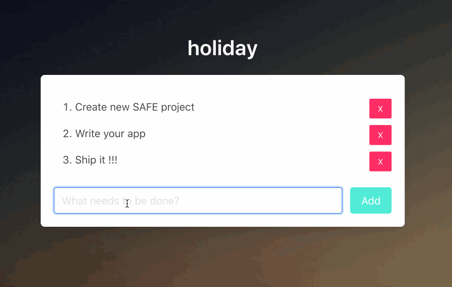
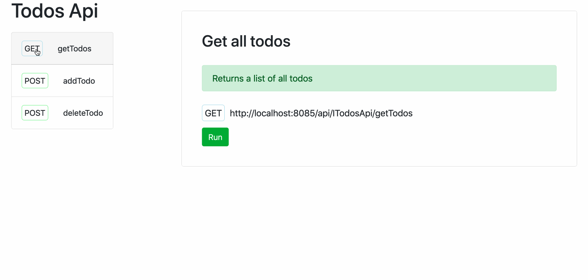

## Fable remoting

<<<<<<< HEAD
I am a big fan of F#
It is very enjoyable to code in and I really like its domain modelling capabilities.
You can use it for fullstack development and easily share code between the front and back end.
Lets take a look at Fable remoting, a really interesting way of doing this.

I will assume some familiarity with F# and MVU. I will, however, add some great F# resources at the bottom of this article.
=======
I am a big fan of F#!
It is very enjoyable to code in and I am a big fan of its domain modelling capabilities.
F# can be used to write both frontend and backend projects. You can share code between the two and they can work really well together.
In this this short article we will take a quick look at Fable remoting, a nice way to get the frontend and backend communicating with each other.

I will assume some familiarity with F# and MVU here! I will however add some great F# resources at the bottom of this article.
>>>>>>> 56b1389... Change some stuff

We will scaffold the project with [Safe-Stack](https://safe-stack.github.io/).
This will give us a fullstack project that has a nice and simple todo list set up with fable remoting, this todo list is what we will be editing.

<<<<<<< HEAD
Safe-stack sets us up with a file, `shared.fs`, where the code shared between client and server lives. Lets take a look at it.
=======
Using F# for both your backend and your frontend means you can share code between the two. Safe-stack gives you a nice `shared.fs` file where our domain logic will reside. Lets take a look at it!
>>>>>>> 56b1389... Change some stuff

The very first thing in this file is the record defining our todo type. 
```fsharp
type Todo =
    { Id : Guid
      Description : string }
```
Nice and simple! We also have a module that lets us validate and create our todos.

<<<<<<< HEAD
=======
The very first thing defined in this file is the record defining our todo type. Nice and simple! We also have a module that lets us validate and create our todos.
>>>>>>> 56b1389... Change some stuff

Then there's the following, which is used to create the routes that Fable remoting will be using to perform requests for us.
```fsharp
module Route =
    let builder typeName methodName =
        sprintf "/api/%s/%s" typeName methodName
```
<<<<<<< HEAD

And finally the interface defining our routes.
```fsharp
=======
which basicly is a function that creates the routes Fable remoting will be using.

And finally the magicical interface defining our routes!
```
>>>>>>> 56b1389... Change some stuff
type ITodosApi =
    { getTodos : unit -> Async
      addTodo : Todo -> Async }
```

<<<<<<< HEAD
As you can see the todo list supports two operations already.
- `getTodos` which takes no arguments and returns a list of todos.
- `addTodo` which takes a todo as input and returns the newly created todo.

Now lets take a look at how the frontend uses this.

### Frontend

In `Index.fs` we have a todo API:
```fsharp
=======
This interface defines the functions the backend supports that the frontend can use.
The todo list already has 2 of these provided for us:
- `getTodos` which takes no argument and returns a list of todos.
- `addTodo` which takes a todo as input and returns the newly created todo.

Now lets take a look at how the frontend uses this thing.
In `Index.fs` file we immediatly see we have a todo API there
```
>>>>>>> 56b1389... Change some stuff
let todosApi =
    Remoting.createApi()
    |> Remoting.withRouteBuilder Route.builder
    |> Remoting.buildProxy<ITodosApi>
```
<<<<<<< HEAD
This creates the API so it is ready for the client to use.
We can see the first example of how to use it in the `init` function.
```fsharp
1: let init(): Model * Cmd<Msg> =
2:   let model =
3:        { Todos = []
4:          Input = "" }
5:    let cmd = Cmd.OfAsync.perform todosApi.getTodos () GotTodos
6:    model, cmd
=======
This sets up our API so can start calling stuff!
In the `init` function we see the first example of how we can use it.
```
let cmd = Cmd.OfAsync.perform todosApi.getTodos () GotTodos
>>>>>>> 56b1389... Change some stuff
```
This sets up the MVU model and on line 5 the client asks for all the todos.
Once this async function resolves the `GotTodos` command is executed.

<<<<<<< HEAD
Performing requests with Fable remoting is that easy!
No strings, no serialization, no deserialization, none of that boring stuff!
Its just a function call and it is all type safe!
=======
This performs calls `getTodos` function , defined in our interface, and if successfull calls the MVU command `GotTodos`.
Wow that was easy! No strings, no serialization, no deserializition none of that boring stuff! We just call the function and it is all type safe!
>>>>>>> 56b1389... Change some stuff

Time to look at the backend.

### Backend

The server needs to implement the interface defined in the shared file.
And we can find that implementation in `Server.fs`

```fsharp
let todosApi =
    { getTodos = fun () -> async { return storage.GetTodos() }
      addTodo =
        fun todo -> async {
            match storage.AddTodo todo with
            | Ok () -> return todo
            | Error e -> return failwith e
        } }
```

<<<<<<< HEAD
This is an implementation of the interface defined in the shared file.
In this example all the functions are declared within the type, but they could just as well be separate as long as they match the interface.
=======
Thats our API! In this example all our functions are inline in that type implementation, but they could just as well be separate.
>>>>>>> 56b1389... Change some stuff

Cool! Now that we are all caught up lets start editing this API and expanding it a little bit.
Here we go... Lets delete a todo!

### Deletion time

Lets start by adding a function to the interface in `Shared.fs`.
```fsharp
type ITodosApi =
    { getTodos : unit -> Async<Todo list>
      addTodo : Todo -> Async<Todo>
      deleteTodo : Guid -> Async<Guid>}
```
Our interface now supports deletion!
All the functions we define in this interface have to return an async and we want to know if the delete succeeded. So we return the `guid` of the deleted todo item if it succeeds.

<<<<<<< HEAD
We also have to add this function to the server so we can edit the storage class.
```fsharp
=======
We also have to add this function to the server so we edit the storage class and the implementation API with these lines
Storage:
```
>>>>>>> 56b1389... Change some stuff
member __.DeleteTodo (id: Guid) =
    let toDelete = todos.Find(fun x -> x.Id = id)
    let deletedTodo = todos.Remove(toDelete)
    if deletedTodo then
        Ok id
    else
        sprintf "Unable to delete todo with GUID: %A" id
        |> Error
```
<<<<<<< HEAD
Here we try to find a todo with the same GUID as we passed in. If we find one we try to remove it from our list.
If it is removed wrap the Id into an `Ok` type and return. Otherwise we return an `Error`.

The only thing missing from having a finished API is implementing the delete function itself.
All it has to do is call the call the delete method on the storage class.
In reality this could be editing a database or whatever else you fancy.
```fsharp
let todosApi =
    { getTodos = fun () -> async { return storage.GetTodos() }
      addTodo =
        fun todo -> async {
            match storage.AddTodo todo with
            | Ok () -> return todo
            | Error e -> return failwith e
        }
      // Our function starts here
      deleteTodo =
          fun id -> async {
              match storage.DeleteTodo(id) with
              | Ok _ -> return id
              | Error e -> return failwith e
      }
    }
=======
Here we try to find a todo with the same GUID as we passsed in. If we find one we try to remove it from our list.
If it is removed wrap the Id into an `Ok` type and return. Otherwise we return an `Error` type

Api:
```
deleteTodo =
    fun id -> async {
        match storage.DeleteTodo(id) with
        | Ok _ -> return id
        | Error e -> return failwith e
}
>>>>>>> 56b1389... Change some stuff
```
In the API we just check if it was `Ok` or `Error` and return the Id.

Now we need to reflect these changes in the frontend.
<<<<<<< HEAD
We need some new commands so we can call our function and delete a todo from the list.
In `Index.fs` we change the `Msg` type
```fsharp
=======
We need some new command so we can call our function and delete a todo from the list in in the frontend.
It is a simple change and we put into our `Msg` type
In `Index.fs` we now have this type
```
>>>>>>> 56b1389... Change some stuff
type Msg =
    | GotTodos of Todo list
    | SetInput of string
    | AddTodo
    | AddedTodo of Todo
    | DeleteTodo of Guid // Called when we click the delete button
    | DeletedTodo of Guid // Called when we get a reply from the server
```

We now have 2 new commands to implement in the `update` function. They look like this.
```fsharp
| DeleteTodo id ->
    let cmd = Cmd.OfAsync.perform todosApi.deleteTodo id DeletedTodo
    model, cmd
| DeletedTodo id ->
    let todosAfterRemove = List.filter (fun x -> x.Id <> id ) model.Todos
    { model with Todos = todosAfterRemove }, Cmd.none
```

<<<<<<< HEAD
Again we use the endpoint using the same pattern. We call the function, and when it resolves, perform a command.

Finally we need to have some way of actually deleting from the view.

In the `containerBox` function we list each todo and we want to add a button there.
Lets also add some inline styling (you might want to look away).
```fsharp
=======

Finally we need to have some way of actually deleting from the view.

In the `containerBox` function we list out each todo and we want to add a button here.
SafeStack template uses an F# wrapper for Bulma called Fulma, I am not very used to it so try to ignore the inline styling here.
```
>>>>>>> 56b1389... Change some stuff
for todo in model.Todos do
    div [ Style [ Display DisplayOptions.Flex; Custom("justify-content", "space-between"); MarginBottom 10 ] ]
        [
            li [] [ str todo.Description ]
            Button.button [
                Button.Color IsDanger
                Button.Size IsSmall
                Button.OnClick (fun _ -> DeleteTodo todo.Id |> dispatch)
            ] [ str "X"  ]
        ]
```

And that's it.
Here we have it. We added a delete route for our todos.

Heres a quick demo!



It is important to keep in mind that under the hood this is just normal HTTP requests going backwards and forwards. That means you can still test them using Postman and similar tools.

Finally another pretty cool thing we can do is document our api and get a nice overview of it - kind of like swagger.
The following is a really simple documentation that can be accessed at `localhost:8085/api/todos/docs`
```
let docs = Docs.createFor<ITodosApi>()
let todosApiDocs =
    Remoting.documentation "Todos Api"
        [
            docs.route <@ fun (api: ITodosApi) -> api.getTodos @>
            |> docs.alias "Get all todos"
            |> docs.description "Returns a list of all todos"

            docs.route <@ fun (api: ITodosApi) -> api.addTodo @>
            |> docs.alias "Add new todo"
            |> docs.description "Adds a new todo item to the list"

            docs.route <@ fun (api: ITodosApi) -> api.deleteTodo @>
            |> docs.alias "Delete a todo"
            |> docs.description "Removes a todo item from the list"
        ]
```



<<<<<<< HEAD
While being a simple example of using Fable remoting. I think it is clear to see how you can communicate between client and server without having to worry about serialization, deserialization, misspelling your path name - or anything like that!
It is simply defining and implementing a common interface and calling those functions, oh and did I mention that its all type safe?
You can just focus on your domain models and doman logic.
=======
While being a simple example of using Fable remoting. I think it is clear to see how you can communicate with your backend without having to worry about serialization, deserializition or misspelling your path name - or anything like that!
It is simply defining and implementing a common interface and calling those functions.
All you really have to worry about are your domain models and doman logic and it is all type safe.
>>>>>>> 56b1389... Change some stuff
I find it really neat!
Hopefully you found it interesting too and you want to explore it further.

Check the source code for this [github](https://github.com/Bjorn-Strom/Holiday)

If you want to read more about Fable Remoting you can check out [this blog post](https://github.com/Zaid-Ajaj/Fable.Remoting) by the author of Fable Remoting Zaid Ajaj or go check out [SAFE stack](https://safe-stack.github.io/).

Zaid has also written an [excellent and free book](https://zaid-ajaj.github.io/the-elmish-book/#/) about Elmish, If you want to learn more I suggest you go take a look!

<<<<<<< HEAD
=======
Zaid has also written an [excellent and free book](https://zaid-ajaj.github.io/the-elmish-book/#/) about Elmish, If you want to learn more about Elmish I suggest you go take a look!
>>>>>>> 56b1389... Change some stuff
